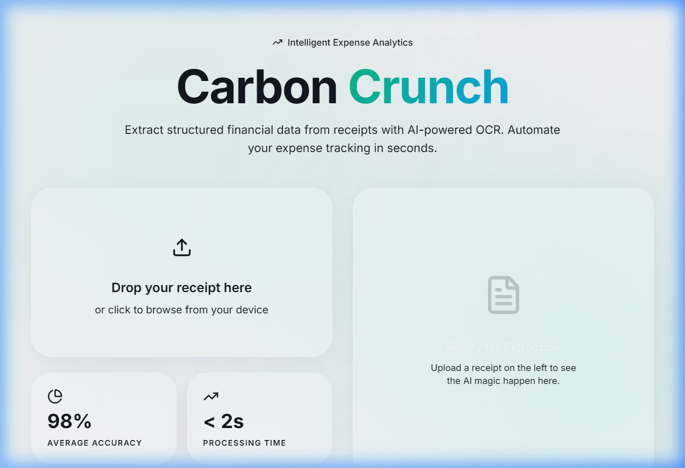

#  Carbon Crunch

**Carbon Crunch** is a premium, AI-powered receipt scanning and expense analytics tool. It leverages deep learning OCR to extract structured financial data from receipt images, providing a seamless and interactive experience with a modern **Frosted Glass (Glassmorphism)** design.



##  Features

- **🤖 AI-Powered OCR**: Uses EasyOCR (ResNet + LSTM) for robust text detection and recognition.
- **❄️ Frosted Glass UI**: A beautiful, light-mode glassmorphism interface built with React and Tailwind CSS.
- **📊 Real-time Extraction**: Instantly extracts Store Name, Date, Line Items, and Total Amount.
- **📈 Confidence Scoring**: Visual indicators for extraction reliability with automated review flags.
- **✨ Smooth Interactions**: Powered by Framer Motion for a fluid, premium user experience.
- **🚀 Advanced Preprocessing**: Uses OpenCV for denoising, thresholding, and deskewing to ensure high accuracy even with noisy images.

##  Technology Stack

### Backend
- **Python / Flask**: Robust API layer.
- **EasyOCR**: Deep learning-based OCR engine.
- **OpenCV**: Computer vision for image optimization.
- **Numpy**: Efficient data processing.

### Frontend
- **React / Vite**: Fast, modern frontend framework.
- **Tailwind CSS**: Utility-first styling with custom glassmorphism filters.
- **Framer Motion**: State-of-the-art animations.
- **Lucide React**: Clean, consistent iconography.

##  Getting Started

### Prerequisites
- Python 3.8+
- Node.js 18+

### Installation

1. **Clone the repository**:
   ```bash
   git clone https://github.com/GLITCHINvision/carbon-crunch.git
   cd carbon-crunch
   ```

2. **Setup Backend**:
   ```bash
   cd backend
   # Create virtual environment
   python -m venv venv
   # Activate venv (Windows)
   .\venv\Scripts\activate
   # Install dependencies
   pip install flask flask-cors easyocr opencv-python numpy
   # Run the server
   python app.py
   ```

3. **Setup Frontend**:
   ```bash
   cd ../frontend
   npm install
   npm run dev
   ```

The application will be available at `http://localhost:5173`.

##  How It Works

1. **Image Preprocessing**: Raw receipt photos are cleaned using adaptive thresholding and noise reduction (OpenCV) to normalize lighting and remove shadows.
2. **Text Detection**: The EasyOCR engine identifies text regions using a CRAFT detection model.
3. **Data Extraction**: A custom heuristic engine processes the raw text to identify financial entities like prices, vendors, and line items.
4. **Validation**: The system calculates a confidence score based on character reliability and pattern matching, flagging any items that may require human verification.

##  License
Distributed under the MIT License. See `LICENSE` for more information.

---
Built with  by [GLITCHINvision](https://github.com/GLITCHINvision)
